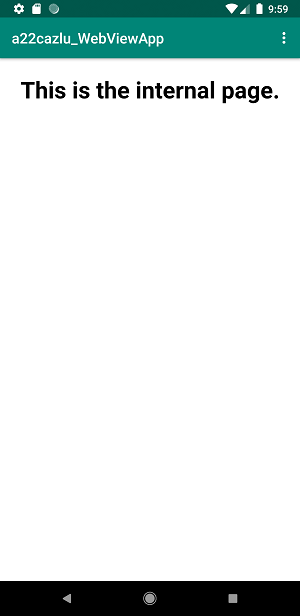
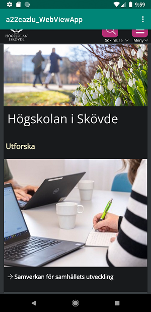

# Rapport

Jag började med att byta namn på appen i string.xml till a22cazlu_WebviewApp.
``` 
<string name="app_name">a22cazlu_WebViewApp</string>
```

För att göra internet tillgängligt skrevs koden under in i AndroidManifest.xml.
```
<string name="app_name">a22cazlu_WebViewApp</string>
```

Sedan bytes den existerande Textview elementet ut mot en WebView i activity_main.xml som sedan fick ID my_webview.

I MainActivity.java skapades sedan en WebView variabel som fick namnet myWebView. Under onCreate instansierades variabeln med hjälp utav:
```
myWebView = findViewById(R.id.my_webview);
```
Jag skapade en ny WebViewClient som sedan med hjälp utav `getSettings()` och `setJavaScriptEnabled()` gjorde det så att man kan använda JavaScript i den.

För att ha en intärn sida skapades en html-sida som en asset. Med hjälp av loadURL() som skrevs in i showExternalWebPage() och showInternalWebPage() kommer man till den externa samt den intärna sidan.

Till slut ska man kunna klicka på menyn och välja vilken sida man vill gå till, den extärna eller den intärna. Då lades showExternalWebPage() in i if-satsen där den kollar om man klickat på knappen till den extärna och showInternalWebPage() i i if-satsen där den kollar om man klickat på knappen till den intärna.
```
 if (id == R.id.action_external_web) {
            Log.d("==>","Will display external web page");
            showExternalWebPage();
            return true;
        }
```
Nedan finns skärmdumpar på den intärna samt den extärna sidan.



**Figur 1:** The internal page



**Figur 2:** The external page
